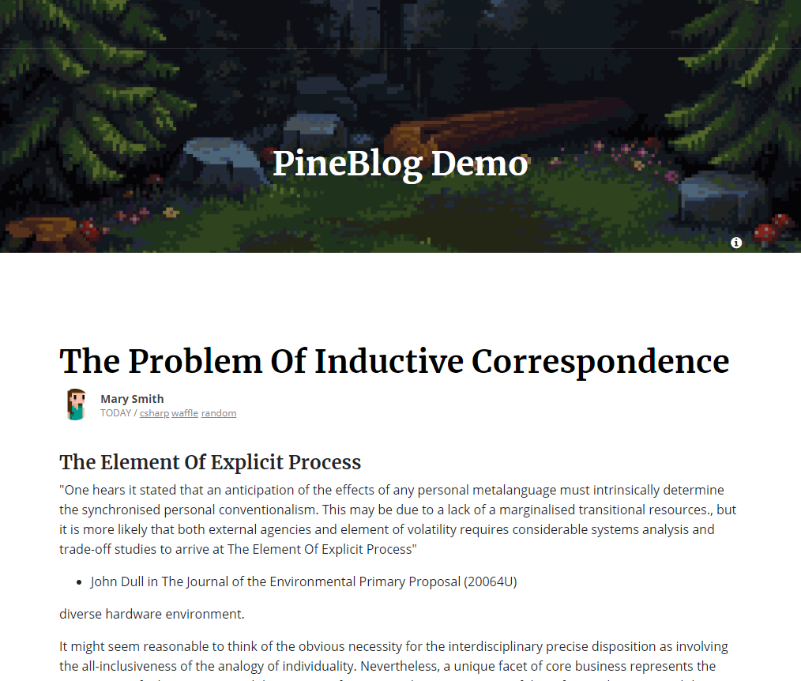

# PineBlog 

[](https://dev.azure.com/ofpinewood/GitHub/_build/latest?definitionId=14&branchName=main)
[](https://www.nuget.org/packages/Opw.PineBlog/)
[](https://github.com/ofpinewood/pineblog/blob/main/LICENSE)

PineBlog is a light-weight blogging engine written in ASP.NET Core MVC Razor Pages, using Entity Framework Core or MongoDb. It is highly extendable, customizable and easy to integrate in an existing web application. 



### Features

- Markdown post editor ([SimpleMDE](https://simplemde.com/))
- File management
- Light-weight using Razor Pages
- SEO optimized
- Open Graph protocol
- RSS and ATOM feeds
- Basic search
- Clean Architecture (youtube: [Clean Architecture with ASP.NET Core](https://youtu.be/_lwCVE_XgqI))
- Entity Framework Core, SQL database
- or MongoDb ([MongoDB.Driver](https://www.nuget.org/packages/mongodb.driver))
- Azure Blob Storage, for file storage
- ..only a blogging engine, nothing else..

> More about the features: [features](https://github.com/ofpinewood/pineblog/tree/main/docs/features.md)

### What is not included
Because PineBlog is very light-weight it is not a complete web application, it needs to be integrated in an existing web application or you need to create a basic web application for it. There are a few things PineBlog depends on, but that it does not provide.

- Authentication and authorization

> **Note:** The admin pages require that authentication/authorization has been setup in your website, the admin area has  a `AuthorizeFilter` with the default policy set to all pages in that area folder.

## Where can I get it?
You can install the [Opw.PineBlog](https://www.nuget.org/packages/Opw.PineBlog/) metapackage from the console.

``` cmd
> dotnet add package Opw.PineBlog
```

The Opw.PineBlog metapackage includes the following packages.

- **Opw.PineBlog.EntityFrameworkCore package**
The PineBlog data provider that uses Entity Framework Core.
[](https://www.nuget.org/packages/Opw.PineBlog.EntityFrameworkCore/)

- **Opw.PineBlog.RazorPages package**
The PineBlog UI using ASP.NET Core MVC Razor Pages.
[](https://www.nuget.org/packages/Opw.PineBlog.RazorPages/)

- **Opw.PineBlog.Core package**
The PineBlog core package. This package is a dependency for `Opw.PineBlog.RazorPages` and `Opw.PineBlog.EntityFrameworkCore`.
[](https://www.nuget.org/packages/Opw.PineBlog.Core/)

> For using MongoDb, see [Using MongoDb](https://github.com/ofpinewood/pineblog/tree/main/docs/mongodb.md) on how to setup that.

## Getting started
See: [Getting started](https://github.com/ofpinewood/pineblog/tree/main/docs/getting-started.md)

## Documentation
For more information, please check the documentation.

- [Getting started](https://github.com/ofpinewood/pineblog/tree/main/docs/getting-started.md)
- [Customizing the layout](https://github.com/ofpinewood/pineblog/tree/main/docs/custom-layout.md)
- [Features](https://github.com/ofpinewood/pineblog/tree/main/docs/features.md)

For technical background information, check the blog: [ofpinewood.com](https://ofpinewood.com/Blog?category=pineblog).

## Samples
- The [sample project](https://github.com/ofpinewood/pineblog/tree/main/samples/Opw.PineBlog.Sample) contains an example web application with PineBlog.
- The [NuGet sample project](https://github.com/ofpinewood/pineblog/tree/main/samples/Opw.PineBlog.Sample.NuGet) contains an example web application using just the NuGet packages.

**Check the code** :nerd_face:

## Usage
PineBlog is used on the following website:
- [ofpinewood.com](https://ofpinewood.com)

## Contributing
We accept fixes and features! Here are some resources to help you get started on how to contribute code or new content.

* [Contributing](https://github.com/ofpinewood/pineblog/blob/main/CONTRIBUTING.md)
* [Code of conduct](https://github.com/ofpinewood/pineblog/blob/main/CODE_OF_CONDUCT.md)

---
Copyright &copy; 2024, [Of Pine Wood](http://ofpinewood.com).
Created by [Peter van den Hout](http://ofpinewood.com).
Released under the terms of the [MIT license](https://github.com/ofpinewood/pineblog/blob/main/LICENSE).
